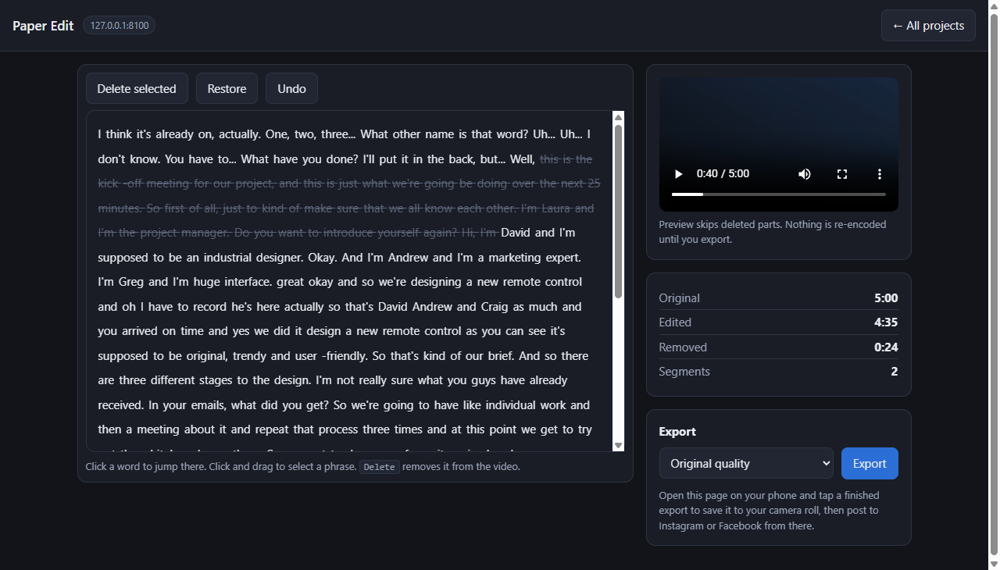

# Paper Edit

A local, text-based video editor — edit long-form video and podcasts by editing the
transcript. Everything runs on your own machine: no cloud, no subscription, no account.



*Struck-through words are gone from the video. The preview skips them immediately — nothing
is re-encoded until you export. (Sample audio: [AMI Meeting Corpus](https://groups.inf.ed.ac.uk/ami/corpus/), CC BY 4.0.)*

**Status: Phase 1 working end to end** — upload, transcribe, edit the transcript, export.
See `FINDINGS.md` for what was measured, and `ROADMAP.md` for what is built,
what is planned, and what is deliberately left out.

## Using it

On Windows, double-click **`Start Paper Edit.cmd`** (it sets itself up on first run).
Anywhere else, run `python server.py` in the venv. Either way it prints the addresses it
is reachable on:

```
  on this computer     http://localhost:8100
  on your network      http://192.168.x.x:8100
```

Open the network address from a laptop, phone or tablet and the editing happens on the
machine with the GPU while you drive it from anywhere in the house.

Pick a video or audio file and press **Upload & transcribe**. Uploads resume by themselves
if the Wi-Fi drops. When the transcript appears, click a word to jump there, drag to select
a phrase, and press Delete — the video loses exactly that piece. Preview is instant because
nothing is re-encoded until you press Export.

**The host machine has to be awake.** The editor is only there while the server is running.

## Setup

```bash
python -m venv .venv
.venv/Scripts/python.exe -m pip install -r requirements.txt
.venv/Scripts/python.exe -m pytest tests/ -q
```

## What exists so far

| file | what it does |
|---|---|
| `paperedit/edl.py` | The edit decision list. The transcript *is* the edit — words carry `deleted`, cuts are derived from what survives. |
| `paperedit/audio.py` | Silence detection: snap points for clean cuts, and the basis of Phase 2 silence removal. |
| `paperedit/render.py` | ffmpeg export (NVENC), proxy generation, filter-graph builder with audio crossfades at joins. |
| `cuda_setup.py` | Registers the venv's bundled CUDA DLLs so `device="cuda"` actually works on Windows. |
| `paperedit/store.py` | SQLite project, word and job state. On disk, so a nightly shutdown mid-transcription shows as interrupted instead of spinning forever. |
| `paperedit/transcribe.py` | Word-level transcription; large-v3 on the GPU when it is free, small on CPU otherwise. |
| `server.py` | FastAPI on :8100 — resumable upload, ingest, edit, export. |
| `static/` | The editor UI. Plain HTML and JS, no build step. |
| `spikes/` | The Phase 0 measurements. Each script prints its own numbers. |
| `tests/` | 18 tests: EDL invariants plus a full upload-to-export run against real media. |

## Next

**Phase 1 is built and tested; the remaining Phase 1 step is human.** Put a real recording
of hers through it and get her verdict before building anything else — that is the go/no-go.

Then Phase 2 (silence removal, Studio Sound) and Phase 3 (animated captions). Note from
`FINDINGS.md`: Whisper only transcribes 7-17% of filler words, so "remove the ums" has to be
built on silence and acoustic detection rather than the transcript. Worth setting that
expectation with her early.

## License

MIT — see `LICENSE`. Use it, change it, ship it.
